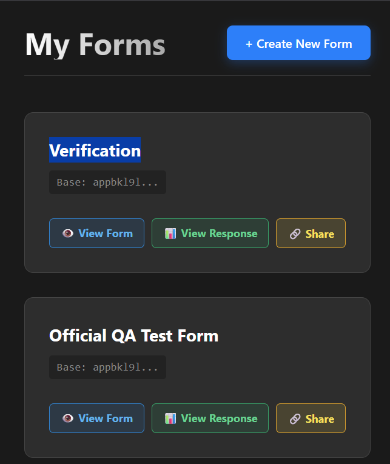
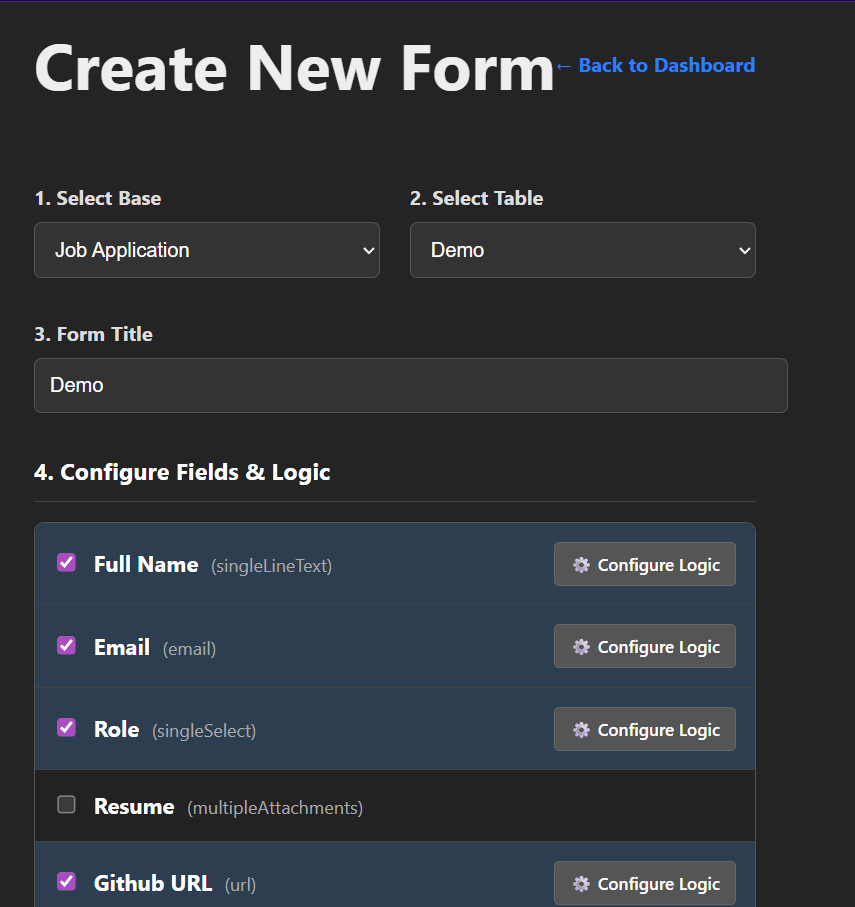
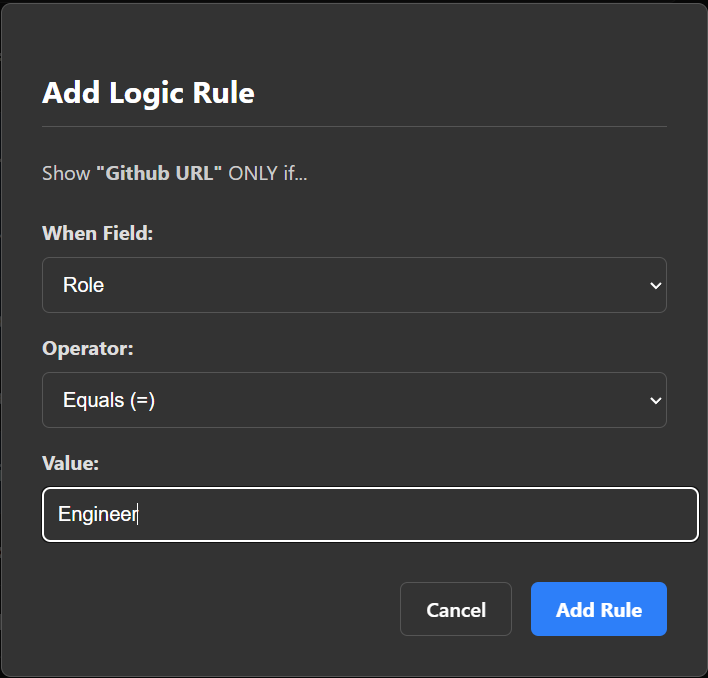
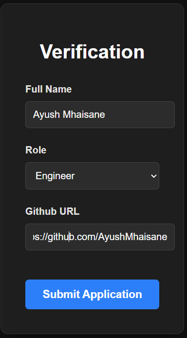

# 🚀 Airtable-Connected Dynamic Form Builder


A full-stack SaaS application that allows users to create **dynamic, logic-driven forms** mapped directly to their **Airtable** databases. It includes OAuth authentication, a custom conditional logic engine, and dual-write sync between Airtable and MongoDB.

🔗 **Live Demo:** https://airtable-form-builder-dun.vercel.app  
*(Login with your Airtable account to try the dashboard)*

---

## 📸 Screenshots

| Admin Dashboard | Create New Form |
| :---: | :---: |
|  |  |

| Add Logic | Visible by Logic |
| :---: | :---: |
|  |  |

---

## ✨ Features

### 🔐 Authentication
- Airtable OAuth 2.0 login
- Custom JWT URL-token strategy (bypasses Safari/Firefox cookie restrictions)

### 🧩 Form Builder
- Pulls Airtable Bases → Tables → Fields dynamically
- Supports text, long text, selects, multi-selects, email, URL, attachments

### 🧠 Conditional Logic Engine
- Runs 100% client-side
- Supports complex AND/OR rule evaluation
- Example: *Show GitHub URL only if Role = Engineer*

### 💾 Dual-Write Sync
- Submissions stored in Airtable **and** MongoDB
- Prevents data loss even if one backend is unavailable

### 📊 Admin Dashboard
- View user submissions
- Shareable public form links
- Clean dark UI

---

## 🛠️ Tech Stack

| Frontend | Backend | Infra |
| --- | --- | --- |
| React (Vite) | Node.js | Vercel |
| React Router | Express.js | Render |
| Axios | MongoDB + Mongoose | MongoDB Atlas |
| CSS Modules | JWT Auth | Airtable API |

---

# 🚀 How to Run Locally

## 1️⃣ Clone the Repo
```bash
git clone https://github.com/your-username/airtable-form-builder.git
cd airtable-form-builder
```

---

## 2️⃣ Backend Setup
```bash
cd server
npm install
```

### Create a `.env` file inside **/server**:
```
PORT=5000
MONGO_URI=your_mongodb_uri
JWT_SECRET=your_secret_key

AIRTABLE_CLIENT_ID=your_airtable_client_id
AIRTABLE_CLIENT_SECRET=your_airtable_client_secret
AIRTABLE_REDIRECT_URI=http://localhost:5000/auth/callback

CLIENT_URL=http://localhost:5173
```

### Start backend:
```bash
npm run dev
```

---

## 3️⃣ Frontend Setup
Open a **new** terminal:

```bash
cd client
npm install
```

### Create `.env` inside **/client**:
```
VITE_API_URL=http://localhost:5000/api
```

### Start frontend:
```bash
npm run dev
```

---

# 🧠 Logic Engine (Core Code)

```js
// client/src/utils/logicEngine.js

export const shouldShowQuestion = (conditions, currentAnswers) => {
  if (!conditions || conditions.rules.length === 0) return true;

  const results = conditions.rules.map(rule => {
    const userAnswer = currentAnswers[rule.relatedFieldId];
    const targetValue = rule.value;

    switch (rule.operator) {
      case 'equals':
        return userAnswer === targetValue;
      case 'not_equals':
        return userAnswer !== targetValue;
      case 'contains':
        return userAnswer?.includes(targetValue);
      default:
        return false;
    }
  });

  return conditions.logic === "OR"
    ? results.some(r => r)
    : results.every(r => r);
};
```

---

# 📂 Project Structure

```
airtable-form-builder/
│
├── client/                 # React Frontend
│   ├── src/
│   │   ├── api/           # Axios configuration
│   │   ├── context/       # Auth context
│   │   ├── pages/         # Dashboard, Builder, Form, Responses
│   │   └── utils/         # Logic engine
│
└── server/                 # Node/Express Backend
    ├── config/            # Database connection
    ├── controllers/       # Auth, Forms, Responses
    ├── middleware/        # JWT Auth middleware
    ├── models/            # MongoDB Models
    └── routes/            # API Routes
```

---

# 📄 License

This project is open-source and available under the **MIT License**.
